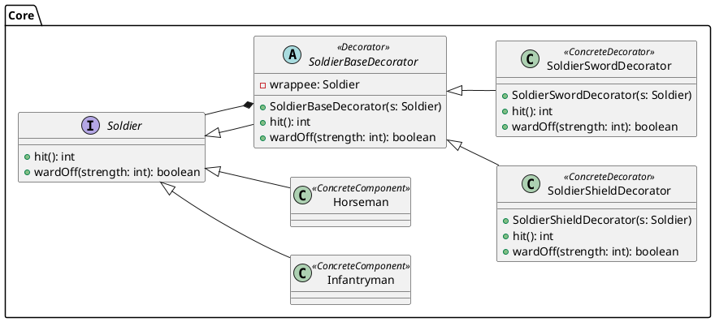
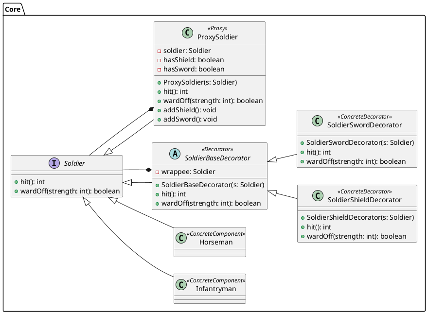
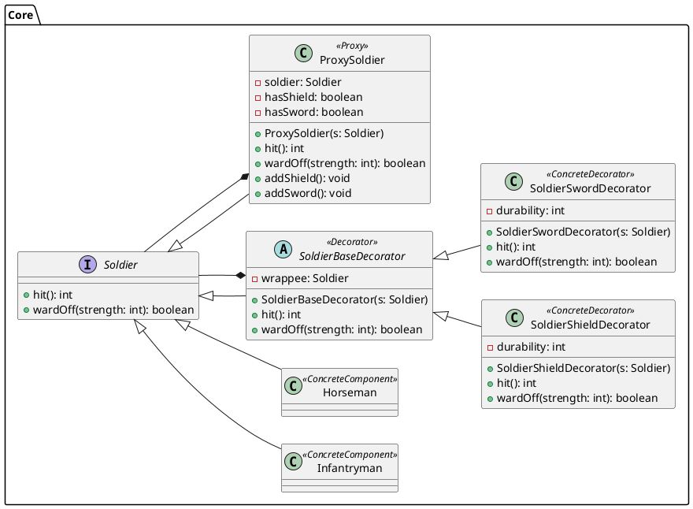
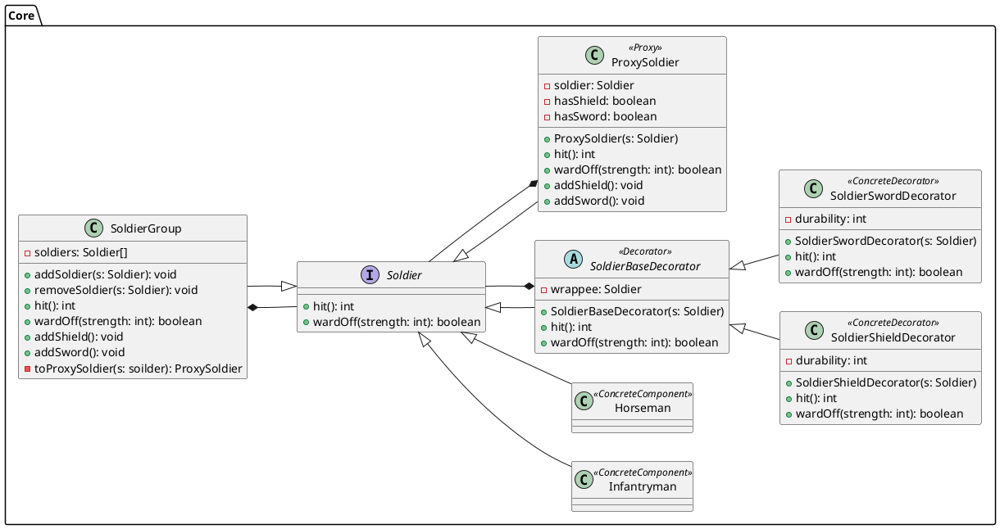
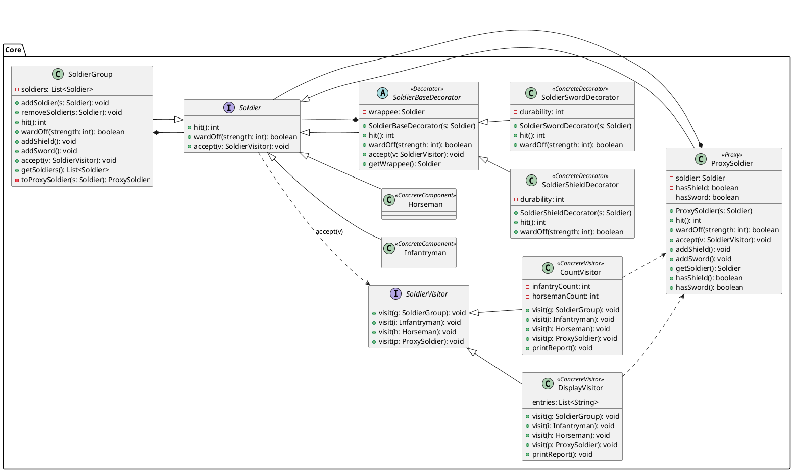
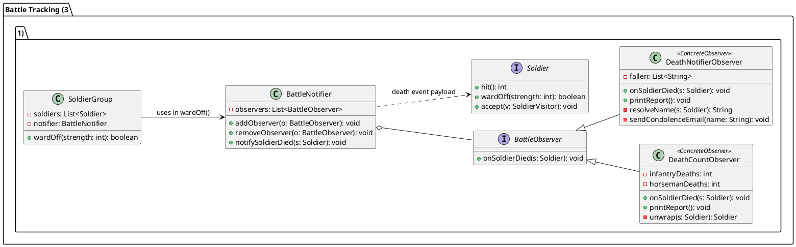
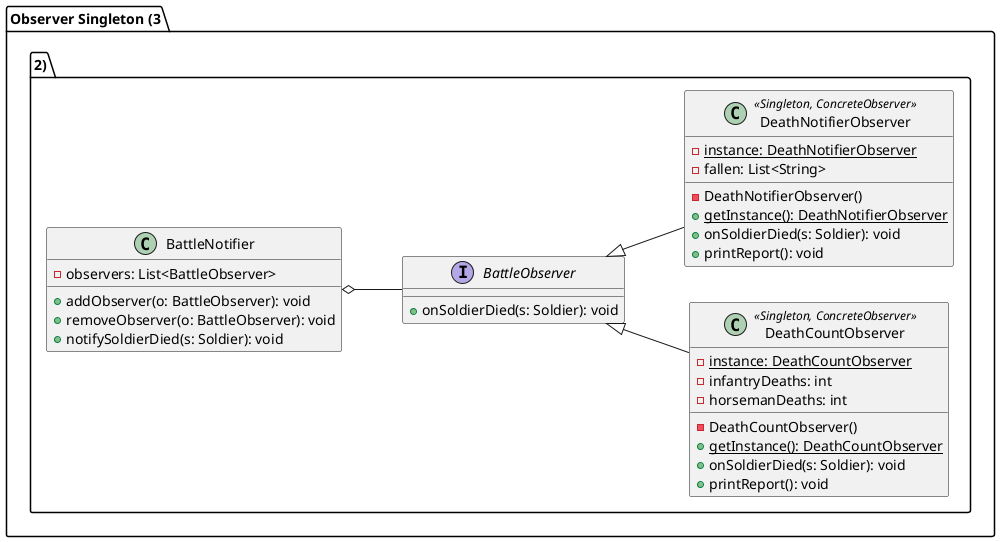
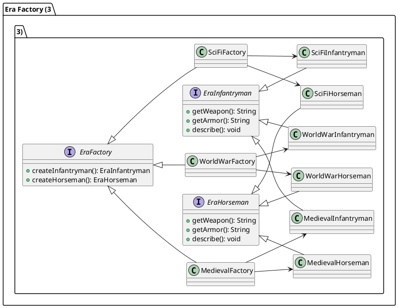

# Class Diagram of Army Game

## Phần 1 - Trang bị cho binh lính

### 1.1. Decorator Pattern

#### Theo Decorator Pattern, "chức năng của đối tượng trở nên phong phú hơn" – điều này có đúng trong trường hợp này không? Giải thích.

Nếu "phong phú hơn" được hiểu theo nghĩa là hành vi hiện có được mở rộng, tăng cường và có thể kết hợp linh hoạt mà không cần sửa đổi lớp gốc, thì câu trả lời là có.
Đối tượng vẫn chỉ có hai hành vi chính là hit() và wardOff(). Tuy nhiên, khi gắn thêm các decorator như Sword hoặc Shield, cách các hành vi này được thực hiện sẽ thay đổi theo hướng làm giàu hành vi hơn:

- hit() có thể gây nhiều sát thương hơn.
- wardOff() có thể giảm bớt sát thương nhận vào.
- Có thể kết hợp nhiều trang bị để tạo ra nhiều biến thể hành vi khác nhau tại runtime mà không cần sửa đổi lớp Infantryman hoặc Horseman.

Do đó, Decorator không làm tăng số lượng phương thức của đối tượng, mà làm tăng tính linh hoạt và khả năng kết hợp hành vi, đúng theo tinh thần mở rộng hành vi một cách động của mẫu thiết kế này.

#### Nếu có thêm ràng buộc: một binh lính không thể mang hai trang bị cùng loại – Decorator có phải là phương pháp thích hợp để đảm bảo ràng buộc này không? Tại sao?

Decorator không phải là phương pháp thích hợp để đảm bảo ràng buộc này. Decorator được thiết kế để mở rộng hành vi của đối tượng một cách linh hoạt tại runtime, chứ không nhằm kiểm soát cấu hình hợp lệ của đối tượng. Ràng buộc này thuộc về tính hợp lệ của cấu hình (configuration constraint), trong khi Decorator không có cơ chế nội tại để kiểm tra toàn bộ chuỗi decorator và phát hiện hai decorator cùng loại nếu chúng không kề nhau. Dù có thể bổ sung kiểm tra ở runtime, điều đó không phải mục tiêu chính của pattern và có thể làm thiết kế trở nên phức tạp và kém minh bạch hơn.

### 1.2. Proxy Pattern

### 1.3. Trang Bị Hao Mòn

## Phần 2 - Tổ Chức Quân Đội

### 2.1. Composite Pattern

### 2.2. Visitor Pattern

## Phần 3 - Theo Dõi & Quản Lý Trận Chiến

### 3.1. Observer Pattern

### 3.2. Singleton Pattern

#### Giải thích tại sao việc giới hạn này lại có ý nghĩa trong bối cảnh theo dõi trận chiến.

Singleton có ý nghĩa ở đây vì cả hai observer đều là **bộ tích lũy trạng thái**. Chúng không xử lý từng sự kiện rồi bỏ qua, mà cộng dồn dữ liệu suốt toàn bộ trận chiến. Nếu tồn tại nhiều instance, mỗi instance chỉ thấy một phần các sự kiện tùy theo nơi nó được đăng ký, dẫn đến báo cáo cuối trận bị sai hoặc mâu thuẫn.

Ngoài ra, bản chất của trận chiến là một sự kiện duy nhất có điểm bắt đầu và kết thúc rõ ràng. Một trận chiến chỉ có một bảng thống kê thương vong thật sự, không phải nhiều bảng song song. Singleton phản ánh đúng thực tế đó vào thiết kế. Toàn bộ hệ thống dù gọi từ bất kỳ đâu cũng đều đọc và ghi vào cùng một nguồn dữ liệu, đảm bảo báo cáo cuối cùng phản ánh toàn bộ trận chiến từ đầu đến cuối.

### 3.3. Abstract Factory Pattern

